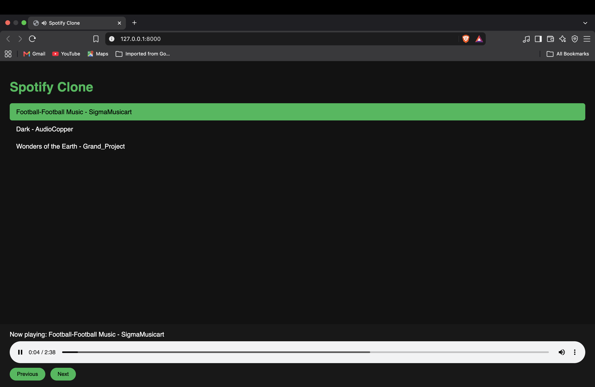

# Spotify Clone
  **Live demo:** https://spotify-clone-sftm.onrender.com
  (Free hosting: the first load may take about a minute while the server wakes up.)

A simple music player web app. Songs are stored in a database, served through a REST API, and played in the browser.



## Features

- Song library stored in a SQLite database
- REST API endpoint (`GET /api/songs`) built with FastAPI
- Audio files served as static files
- Web player with play, previous and next controls
- Autoplay of the next song when one finishes

## Tech Stack

- Python, FastAPI, SQLAlchemy, SQLite
- Jinja2 templates
- HTML, CSS and JavaScript for the player page

## How to Run

```
git clone https://github.com/vinitkumar7629/spotify-clone.git
cd spotify-clone
python3 -m venv venv
source venv/bin/activate
pip install -r requirements.txt
python seed.py
uvicorn app.main:app --reload
```

Then open http://127.0.0.1:8000 in your browser. Interactive API docs are at http://127.0.0.1:8000/docs.

## Project Structure

```
app/
  main.py       FastAPI app and routes
  database.py   database connection and session
  models.py     SQLAlchemy Song model
  schemas.py    response schema
static/audio/   mp3 files
templates/      player page (index.html)
seed.py         adds the starting songs to the database
```

## Planned Improvements

- Search by title or artist
- Playlists and liked songs
- User login with JWT

## Credits

Music from Pixabay (royalty-free).
